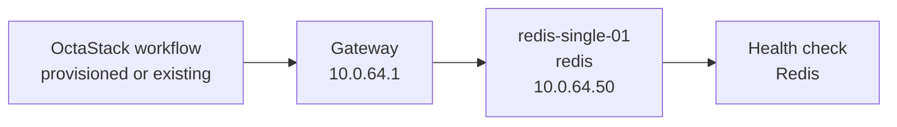
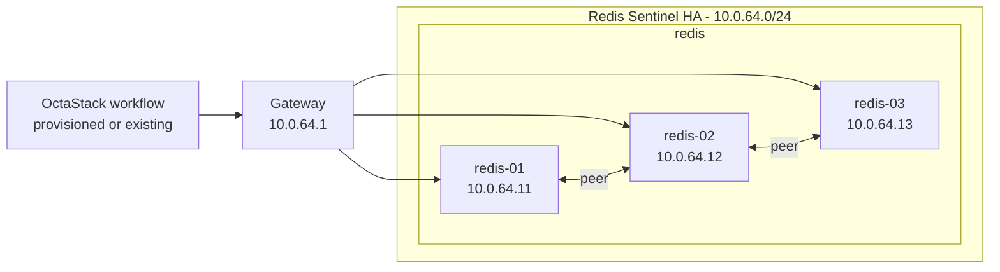
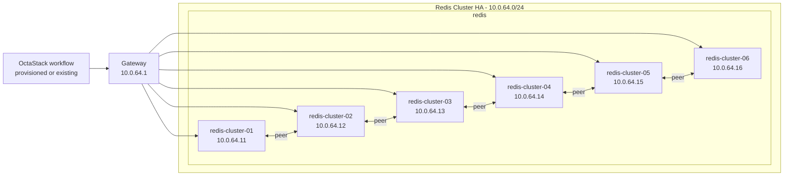

# Redis Topology

This document is generated from `tools/generate-library.mjs`. It describes the logical topology shared by the provisioned and existing-infrastructure workflow variants.

## Stack Summary

- Domain: `cache`
- Workflow path: `workflows/cache/redis`
- Stack network: `10.0.64.0/24`
- Gateway: `10.0.64.1`
- Single-node IP: `10.0.64.50`
- HA status: Generated

## Single-Node Topology

### Single-Node Inventory

| Node | Role | IP address | VM name | CPU | Memory MB | Disk GB |
| --- | --- | --- | --- | --- | --- | --- |
| redis-single-01 | redis | `10.0.64.50` | redis-single-01 | 2 | 4096 | 40 |

### Single-Node Workflows

| Pattern | Provisioning | Workflow |
| --- | --- | --- |
| single-node | provisioned | [single-node-provisioned.json](../../workflows/cache/redis/single-node-provisioned.json) |
| single-node | existing | [single-node-existing.json](../../workflows/cache/redis/single-node-existing.json) |

## High-Availability Topologies

### Redis Sentinel HA

#### HA Inventory

| Node | Role | IP address | VM name | CPU | Memory MB | Disk GB |
| --- | --- | --- | --- | --- | --- | --- |
| redis-01 | redis | `10.0.64.11` | redis-ha-01 | 2 | 4096 | 50 |
| redis-02 | redis | `10.0.64.12` | redis-ha-02 | 2 | 4096 | 50 |
| redis-03 | redis | `10.0.64.13` | redis-ha-03 | 2 | 4096 | 50 |

#### HA Workflows

| Pattern | Provisioning | Workflow |
| --- | --- | --- |
| high-availability | provisioned | [sentinel-ha-provisioned.json](../../workflows/cache/redis/sentinel-ha-provisioned.json) |
| high-availability | existing | [sentinel-ha-existing.json](../../workflows/cache/redis/sentinel-ha-existing.json) |

### Redis Cluster HA

#### HA Inventory

| Node | Role | IP address | VM name | CPU | Memory MB | Disk GB |
| --- | --- | --- | --- | --- | --- | --- |
| redis-cluster-01 | redis | `10.0.64.11` | redis-cluster-01 | 2 | 4096 | 50 |
| redis-cluster-02 | redis | `10.0.64.12` | redis-cluster-02 | 2 | 4096 | 50 |
| redis-cluster-03 | redis | `10.0.64.13` | redis-cluster-03 | 2 | 4096 | 50 |
| redis-cluster-04 | redis | `10.0.64.14` | redis-cluster-04 | 2 | 4096 | 50 |
| redis-cluster-05 | redis | `10.0.64.15` | redis-cluster-05 | 2 | 4096 | 50 |
| redis-cluster-06 | redis | `10.0.64.16` | redis-cluster-06 | 2 | 4096 | 50 |

#### HA Workflows

| Pattern | Provisioning | Workflow |
| --- | --- | --- |
| high-availability | provisioned | [cluster-ha-provisioned.json](../../workflows/cache/redis/cluster-ha-provisioned.json) |
| high-availability | existing | [cluster-ha-existing.json](../../workflows/cache/redis/cluster-ha-existing.json) |

## Addressing Rules

- The stack receives one `/24` from the parent `10.0.0.0/16` plan.
- `.1` is the example gateway.
- `.11-.49` are reserved for HA members and grouped by role in blocks of ten.
- `.50` is reserved for the single-node target.
