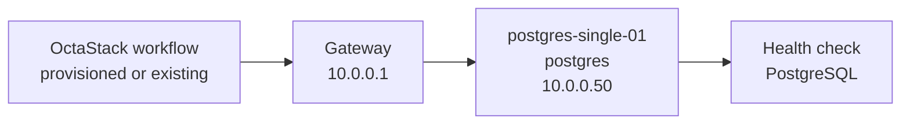
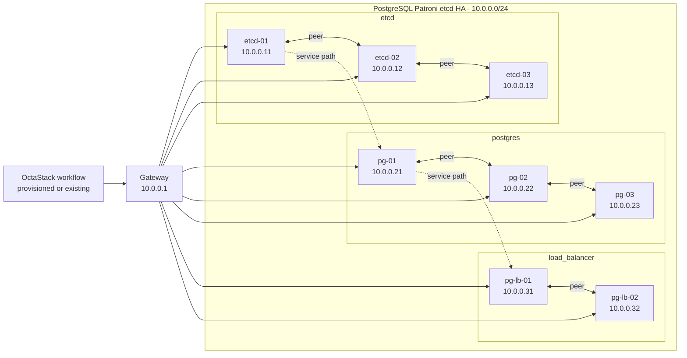

# PostgreSQL Topology

This document is generated from `tools/generate-library.mjs`. It describes the logical topology shared by the provisioned and existing-infrastructure workflow variants.

## Stack Summary

- Domain: `databases`
- Workflow path: `workflows/databases/postgresql`
- Stack network: `10.0.0.0/24`
- Gateway: `10.0.0.1`
- Single-node IP: `10.0.0.50`
- HA status: Generated

## Single-Node Topology

### Single-Node Inventory

| Node | Role | IP address | VM name | CPU | Memory MB | Disk GB |
| --- | --- | --- | --- | --- | --- | --- |
| postgres-single-01 | postgres | `10.0.0.50` | pg-single-01 | 4 | 8192 | 100 |

### Single-Node Workflows

| Pattern | Provisioning | Workflow |
| --- | --- | --- |
| single-node | provisioned | [single-node-provisioned.json](../../workflows/databases/postgresql/single-node-provisioned.json) |
| single-node | existing | [single-node-existing.json](../../workflows/databases/postgresql/single-node-existing.json) |

## High-Availability Topologies

### PostgreSQL Patroni etcd HA

#### HA Inventory

| Node | Role | IP address | VM name | CPU | Memory MB | Disk GB |
| --- | --- | --- | --- | --- | --- | --- |
| etcd-01 | etcd | `10.0.0.11` | pg-etcd-01 | 2 | 4096 | 40 |
| etcd-02 | etcd | `10.0.0.12` | pg-etcd-02 | 2 | 4096 | 40 |
| etcd-03 | etcd | `10.0.0.13` | pg-etcd-03 | 2 | 4096 | 40 |
| pg-01 | postgres | `10.0.0.21` | pg-ha-01 | 4 | 8192 | 150 |
| pg-02 | postgres | `10.0.0.22` | pg-ha-02 | 4 | 8192 | 150 |
| pg-03 | postgres | `10.0.0.23` | pg-ha-03 | 4 | 8192 | 150 |
| pg-lb-01 | load_balancer | `10.0.0.31` | pg-lb-01 | 2 | 2048 | 30 |
| pg-lb-02 | load_balancer | `10.0.0.32` | pg-lb-02 | 2 | 2048 | 30 |

#### HA Workflows

| Pattern | Provisioning | Workflow |
| --- | --- | --- |
| high-availability | provisioned | [ha-patroni-etcd-provisioned.json](../../workflows/databases/postgresql/ha-patroni-etcd-provisioned.json) |
| high-availability | existing | [ha-patroni-etcd-existing.json](../../workflows/databases/postgresql/ha-patroni-etcd-existing.json) |

## Addressing Rules

- The stack receives one `/24` from the parent `10.0.0.0/16` plan.
- `.1` is the example gateway.
- `.11-.49` are reserved for HA members and grouped by role in blocks of ten.
- `.50` is reserved for the single-node target.
