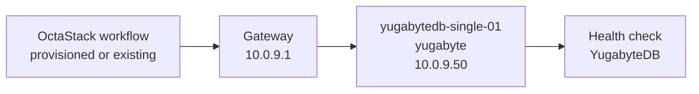
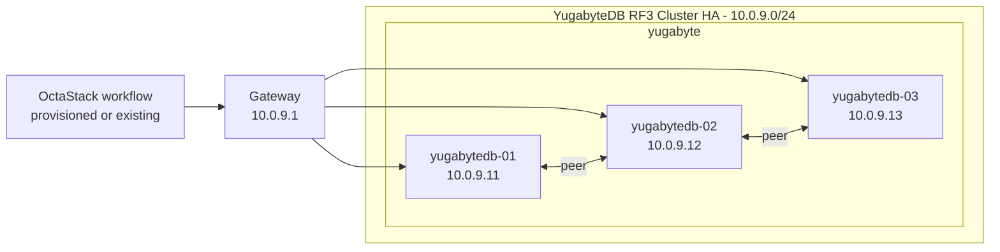

# YugabyteDB Topology

This document is generated from `tools/generate-library.mjs`. It describes the logical topology shared by the provisioned and existing-infrastructure workflow variants.

## Stack Summary

- Domain: `databases`
- Workflow path: `workflows/databases/yugabytedb`
- Stack network: `10.0.9.0/24`
- Gateway: `10.0.9.1`
- Single-node IP: `10.0.9.50`
- HA status: Generated

## Single-Node Topology

### Single-Node Inventory

| Node | Role | IP address | VM name | CPU | Memory MB | Disk GB |
| --- | --- | --- | --- | --- | --- | --- |
| yugabytedb-single-01 | yugabyte | `10.0.9.50` | yugabytedb-single-01 | 4 | 8192 | 80 |

### Single-Node Workflows

| Pattern | Provisioning | Workflow |
| --- | --- | --- |
| single-node | provisioned | [single-node-provisioned.json](../../workflows/databases/yugabytedb/single-node-provisioned.json) |
| single-node | existing | [single-node-existing.json](../../workflows/databases/yugabytedb/single-node-existing.json) |

## High-Availability Topologies

### YugabyteDB RF3 Cluster HA

#### HA Inventory

| Node | Role | IP address | VM name | CPU | Memory MB | Disk GB |
| --- | --- | --- | --- | --- | --- | --- |
| yugabytedb-01 | yugabyte | `10.0.9.11` | yugabytedb-01 | 4 | 8192 | 80 |
| yugabytedb-02 | yugabyte | `10.0.9.12` | yugabytedb-02 | 4 | 8192 | 80 |
| yugabytedb-03 | yugabyte | `10.0.9.13` | yugabytedb-03 | 4 | 8192 | 80 |

#### HA Workflows

| Pattern | Provisioning | Workflow |
| --- | --- | --- |
| high-availability | provisioned | [rf3-cluster-ha-provisioned.json](../../workflows/databases/yugabytedb/rf3-cluster-ha-provisioned.json) |
| high-availability | existing | [rf3-cluster-ha-existing.json](../../workflows/databases/yugabytedb/rf3-cluster-ha-existing.json) |

## Addressing Rules

- The stack receives one `/24` from the parent `10.0.0.0/16` plan.
- `.1` is the example gateway.
- `.11-.49` are reserved for HA members and grouped by role in blocks of ten.
- `.50` is reserved for the single-node target.
