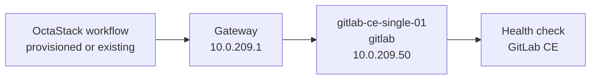

# GitLab CE Topology

This document is generated from `tools/generate-library.mjs`. It describes the logical topology shared by the provisioned and existing-infrastructure workflow variants.

## Stack Summary

- Domain: `devops`
- Workflow path: `workflows/devops/gitlab-ce`
- Stack network: `10.0.209.0/24`
- Gateway: `10.0.209.1`
- Single-node IP: `10.0.209.50`
- HA status: Not generated
- HA note: Not generated; GitLab CE HA requires a larger reference architecture with external PostgreSQL, Redis, Gitaly, Praefect, and load balancers.

## Single-Node Topology

### Single-Node Inventory

| Node | Role | IP address | VM name | CPU | Memory MB | Disk GB |
| --- | --- | --- | --- | --- | --- | --- |
| gitlab-ce-single-01 | gitlab | `10.0.209.50` | gitlab-ce-single-01 | 4 | 8192 | 80 |

### Single-Node Workflows

| Pattern | Provisioning | Workflow |
| --- | --- | --- |
| single-node | provisioned | [single-node-provisioned.json](../../workflows/devops/gitlab-ce/single-node-provisioned.json) |
| single-node | existing | [single-node-existing.json](../../workflows/devops/gitlab-ce/single-node-existing.json) |

## High-Availability Topologies

Not generated; GitLab CE HA requires a larger reference architecture with external PostgreSQL, Redis, Gitaly, Praefect, and load balancers.

## Addressing Rules

- The stack receives one `/24` from the parent `10.0.0.0/16` plan.
- `.1` is the example gateway.
- `.11-.49` are reserved for HA members and grouped by role in blocks of ten.
- `.50` is reserved for the single-node target.
