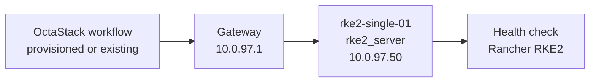
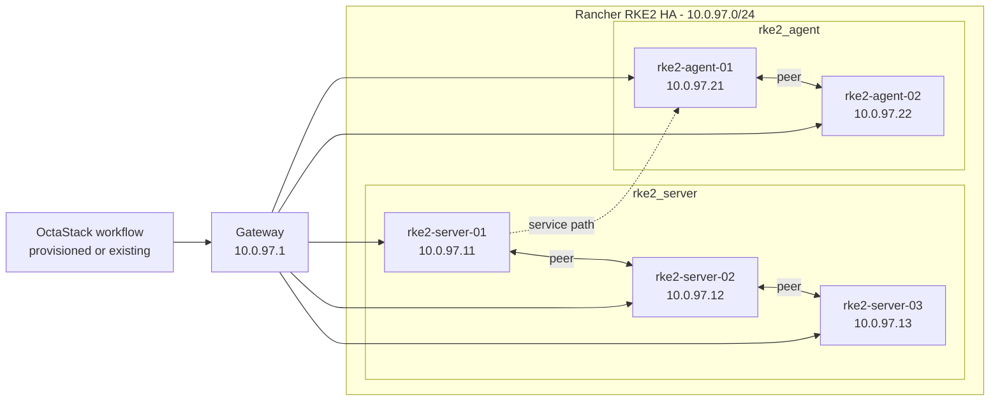

# Rancher RKE2 Topology

This document is generated from `tools/generate-library.mjs`. It describes the logical topology shared by the provisioned and existing-infrastructure workflow variants.

## Stack Summary

- Domain: `kubernetes`
- Workflow path: `workflows/kubernetes/rancher-rke2`
- Stack network: `10.0.97.0/24`
- Gateway: `10.0.97.1`
- Single-node IP: `10.0.97.50`
- HA status: Generated

## Single-Node Topology

### Single-Node Inventory

| Node | Role | IP address | VM name | CPU | Memory MB | Disk GB |
| --- | --- | --- | --- | --- | --- | --- |
| rke2-single-01 | rke2_server | `10.0.97.50` | rke2-single-01 | 4 | 8192 | 100 |

### Single-Node Workflows

| Pattern | Provisioning | Workflow |
| --- | --- | --- |
| single-node | provisioned | [single-server-provisioned.json](../../workflows/kubernetes/rancher-rke2/single-server-provisioned.json) |
| single-node | existing | [single-server-existing.json](../../workflows/kubernetes/rancher-rke2/single-server-existing.json) |

## High-Availability Topologies

### Rancher RKE2 HA

#### HA Inventory

| Node | Role | IP address | VM name | CPU | Memory MB | Disk GB |
| --- | --- | --- | --- | --- | --- | --- |
| rke2-server-01 | rke2_server | `10.0.97.11` | rke2-server-01 | 4 | 8192 | 120 |
| rke2-server-02 | rke2_server | `10.0.97.12` | rke2-server-02 | 4 | 8192 | 120 |
| rke2-server-03 | rke2_server | `10.0.97.13` | rke2-server-03 | 4 | 8192 | 120 |
| rke2-agent-01 | rke2_agent | `10.0.97.21` | rke2-agent-01 | 4 | 8192 | 120 |
| rke2-agent-02 | rke2_agent | `10.0.97.22` | rke2-agent-02 | 4 | 8192 | 120 |

#### HA Workflows

| Pattern | Provisioning | Workflow |
| --- | --- | --- |
| high-availability | provisioned | [ha-server-agent-provisioned.json](../../workflows/kubernetes/rancher-rke2/ha-server-agent-provisioned.json) |
| high-availability | existing | [ha-server-agent-existing.json](../../workflows/kubernetes/rancher-rke2/ha-server-agent-existing.json) |

## Addressing Rules

- The stack receives one `/24` from the parent `10.0.0.0/16` plan.
- `.1` is the example gateway.
- `.11-.49` are reserved for HA members and grouped by role in blocks of ten.
- `.50` is reserved for the single-node target.
