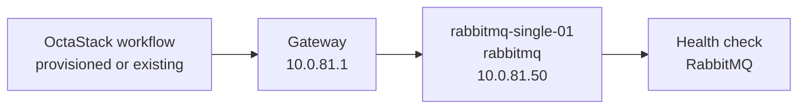
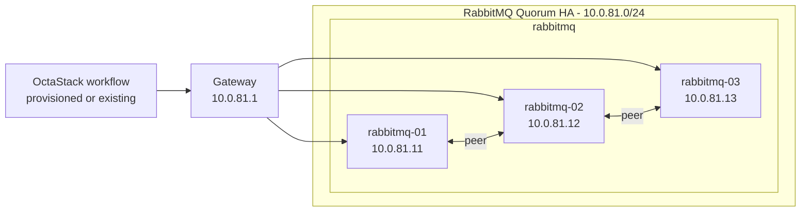

# RabbitMQ Topology

This document is generated from `tools/generate-library.mjs`. It describes the logical topology shared by the provisioned and existing-infrastructure workflow variants.

## Stack Summary

- Domain: `messaging`
- Workflow path: `workflows/messaging/rabbitmq`
- Stack network: `10.0.81.0/24`
- Gateway: `10.0.81.1`
- Single-node IP: `10.0.81.50`
- HA status: Generated

## Single-Node Topology

### Single-Node Inventory

| Node | Role | IP address | VM name | CPU | Memory MB | Disk GB |
| --- | --- | --- | --- | --- | --- | --- |
| rabbitmq-single-01 | rabbitmq | `10.0.81.50` | rabbitmq-single-01 | 2 | 4096 | 60 |

### Single-Node Workflows

| Pattern | Provisioning | Workflow |
| --- | --- | --- |
| single-node | provisioned | [single-node-provisioned.json](../../workflows/messaging/rabbitmq/single-node-provisioned.json) |
| single-node | existing | [single-node-existing.json](../../workflows/messaging/rabbitmq/single-node-existing.json) |

## High-Availability Topologies

### RabbitMQ Quorum HA

#### HA Inventory

| Node | Role | IP address | VM name | CPU | Memory MB | Disk GB |
| --- | --- | --- | --- | --- | --- | --- |
| rabbitmq-01 | rabbitmq | `10.0.81.11` | rabbitmq-ha-01 | 2 | 4096 | 80 |
| rabbitmq-02 | rabbitmq | `10.0.81.12` | rabbitmq-ha-02 | 2 | 4096 | 80 |
| rabbitmq-03 | rabbitmq | `10.0.81.13` | rabbitmq-ha-03 | 2 | 4096 | 80 |

#### HA Workflows

| Pattern | Provisioning | Workflow |
| --- | --- | --- |
| high-availability | provisioned | [quorum-ha-provisioned.json](../../workflows/messaging/rabbitmq/quorum-ha-provisioned.json) |
| high-availability | existing | [quorum-ha-existing.json](../../workflows/messaging/rabbitmq/quorum-ha-existing.json) |

## Addressing Rules

- The stack receives one `/24` from the parent `10.0.0.0/16` plan.
- `.1` is the example gateway.
- `.11-.49` are reserved for HA members and grouped by role in blocks of ten.
- `.50` is reserved for the single-node target.
