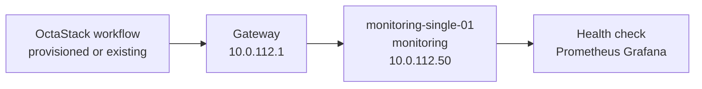
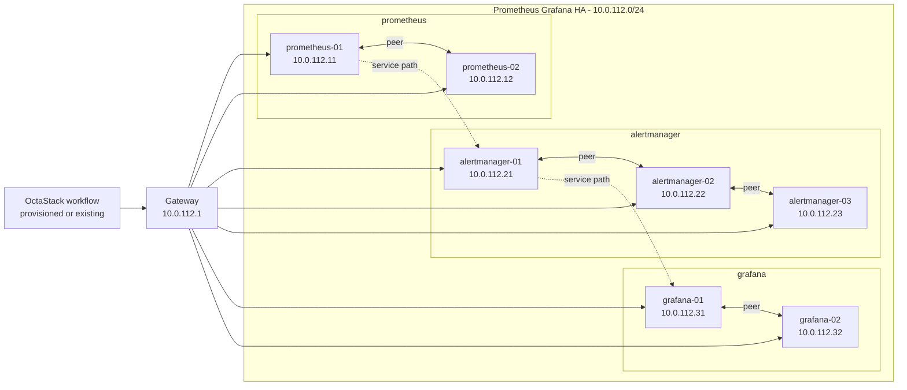

# Prometheus Grafana Topology

This document is generated from `tools/generate-library.mjs`. It describes the logical topology shared by the provisioned and existing-infrastructure workflow variants.

## Stack Summary

- Domain: `monitoring`
- Workflow path: `workflows/monitoring/prometheus-grafana`
- Stack network: `10.0.112.0/24`
- Gateway: `10.0.112.1`
- Single-node IP: `10.0.112.50`
- HA status: Generated

## Single-Node Topology

### Single-Node Inventory

| Node | Role | IP address | VM name | CPU | Memory MB | Disk GB |
| --- | --- | --- | --- | --- | --- | --- |
| monitoring-single-01 | monitoring | `10.0.112.50` | monitoring-single-01 | 2 | 4096 | 80 |

### Single-Node Workflows

| Pattern | Provisioning | Workflow |
| --- | --- | --- |
| single-node | provisioned | [single-node-provisioned.json](../../workflows/monitoring/prometheus-grafana/single-node-provisioned.json) |
| single-node | existing | [single-node-existing.json](../../workflows/monitoring/prometheus-grafana/single-node-existing.json) |

## High-Availability Topologies

### Prometheus Grafana HA

#### HA Inventory

| Node | Role | IP address | VM name | CPU | Memory MB | Disk GB |
| --- | --- | --- | --- | --- | --- | --- |
| prometheus-01 | prometheus | `10.0.112.11` | prometheus-01 | 4 | 8192 | 200 |
| prometheus-02 | prometheus | `10.0.112.12` | prometheus-02 | 4 | 8192 | 200 |
| alertmanager-01 | alertmanager | `10.0.112.21` | alertmanager-01 | 2 | 2048 | 40 |
| alertmanager-02 | alertmanager | `10.0.112.22` | alertmanager-02 | 2 | 2048 | 40 |
| alertmanager-03 | alertmanager | `10.0.112.23` | alertmanager-03 | 2 | 2048 | 40 |
| grafana-01 | grafana | `10.0.112.31` | grafana-01 | 2 | 4096 | 60 |
| grafana-02 | grafana | `10.0.112.32` | grafana-02 | 2 | 4096 | 60 |

#### HA Workflows

| Pattern | Provisioning | Workflow |
| --- | --- | --- |
| high-availability | provisioned | [ha-stack-provisioned.json](../../workflows/monitoring/prometheus-grafana/ha-stack-provisioned.json) |
| high-availability | existing | [ha-stack-existing.json](../../workflows/monitoring/prometheus-grafana/ha-stack-existing.json) |

## Addressing Rules

- The stack receives one `/24` from the parent `10.0.0.0/16` plan.
- `.1` is the example gateway.
- `.11-.49` are reserved for HA members and grouped by role in blocks of ten.
- `.50` is reserved for the single-node target.
