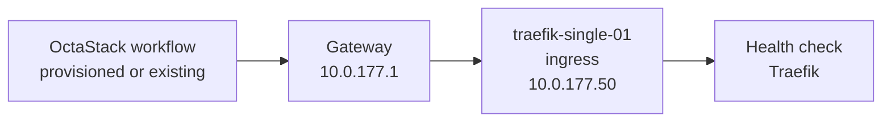
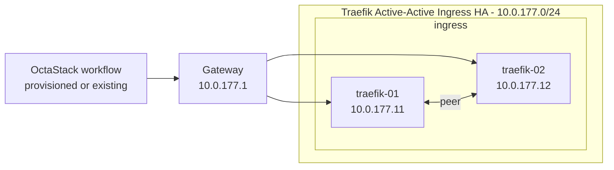

# Traefik Topology

This document is generated from `tools/generate-library.mjs`. It describes the logical topology shared by the provisioned and existing-infrastructure workflow variants.

## Stack Summary

- Domain: `networking`
- Workflow path: `workflows/networking/traefik`
- Stack network: `10.0.177.0/24`
- Gateway: `10.0.177.1`
- Single-node IP: `10.0.177.50`
- HA status: Generated

## Single-Node Topology

### Single-Node Inventory

| Node | Role | IP address | VM name | CPU | Memory MB | Disk GB |
| --- | --- | --- | --- | --- | --- | --- |
| traefik-single-01 | ingress | `10.0.177.50` | traefik-single-01 | 4 | 8192 | 80 |

### Single-Node Workflows

| Pattern | Provisioning | Workflow |
| --- | --- | --- |
| single-node | provisioned | [single-node-provisioned.json](../../workflows/networking/traefik/single-node-provisioned.json) |
| single-node | existing | [single-node-existing.json](../../workflows/networking/traefik/single-node-existing.json) |

## High-Availability Topologies

### Traefik Active-Active Ingress HA

#### HA Inventory

| Node | Role | IP address | VM name | CPU | Memory MB | Disk GB |
| --- | --- | --- | --- | --- | --- | --- |
| traefik-01 | ingress | `10.0.177.11` | traefik-01 | 4 | 8192 | 80 |
| traefik-02 | ingress | `10.0.177.12` | traefik-02 | 4 | 8192 | 80 |

#### HA Workflows

| Pattern | Provisioning | Workflow |
| --- | --- | --- |
| high-availability | provisioned | [active-active-ha-provisioned.json](../../workflows/networking/traefik/active-active-ha-provisioned.json) |
| high-availability | existing | [active-active-ha-existing.json](../../workflows/networking/traefik/active-active-ha-existing.json) |

## Addressing Rules

- The stack receives one `/24` from the parent `10.0.0.0/16` plan.
- `.1` is the example gateway.
- `.11-.49` are reserved for HA members and grouped by role in blocks of ten.
- `.50` is reserved for the single-node target.
