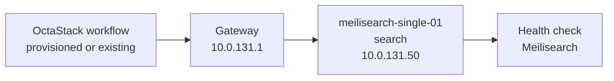

# Meilisearch Topology

This document is generated from `tools/generate-library.mjs`. It describes the logical topology shared by the provisioned and existing-infrastructure workflow variants.

## Stack Summary

- Domain: `search`
- Workflow path: `workflows/search/meilisearch`
- Stack network: `10.0.131.0/24`
- Gateway: `10.0.131.1`
- Single-node IP: `10.0.131.50`
- HA status: Not generated
- HA note: Not generated; this OSS single-node profile does not provide a built-in clustered HA topology.

## Single-Node Topology

### Single-Node Inventory

| Node | Role | IP address | VM name | CPU | Memory MB | Disk GB |
| --- | --- | --- | --- | --- | --- | --- |
| meilisearch-single-01 | search | `10.0.131.50` | meilisearch-single-01 | 4 | 8192 | 80 |

### Single-Node Workflows

| Pattern | Provisioning | Workflow |
| --- | --- | --- |
| single-node | provisioned | [single-node-provisioned.json](../../workflows/search/meilisearch/single-node-provisioned.json) |
| single-node | existing | [single-node-existing.json](../../workflows/search/meilisearch/single-node-existing.json) |

## High-Availability Topologies

Not generated; this OSS single-node profile does not provide a built-in clustered HA topology.

## Addressing Rules

- The stack receives one `/24` from the parent `10.0.0.0/16` plan.
- `.1` is the example gateway.
- `.11-.49` are reserved for HA members and grouped by role in blocks of ten.
- `.50` is reserved for the single-node target.
