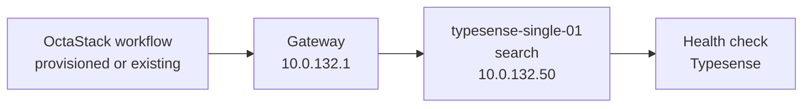
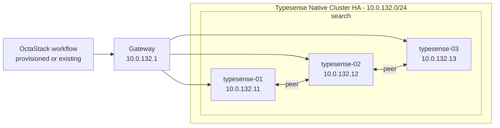

# Typesense Topology

This document is generated from `tools/generate-library.mjs`. It describes the logical topology shared by the provisioned and existing-infrastructure workflow variants.

## Stack Summary

- Domain: `search`
- Workflow path: `workflows/search/typesense`
- Stack network: `10.0.132.0/24`
- Gateway: `10.0.132.1`
- Single-node IP: `10.0.132.50`
- HA status: Generated

## Single-Node Topology

### Single-Node Inventory

| Node | Role | IP address | VM name | CPU | Memory MB | Disk GB |
| --- | --- | --- | --- | --- | --- | --- |
| typesense-single-01 | search | `10.0.132.50` | typesense-single-01 | 4 | 8192 | 80 |

### Single-Node Workflows

| Pattern | Provisioning | Workflow |
| --- | --- | --- |
| single-node | provisioned | [single-node-provisioned.json](../../workflows/search/typesense/single-node-provisioned.json) |
| single-node | existing | [single-node-existing.json](../../workflows/search/typesense/single-node-existing.json) |

## High-Availability Topologies

### Typesense Native Cluster HA

#### HA Inventory

| Node | Role | IP address | VM name | CPU | Memory MB | Disk GB |
| --- | --- | --- | --- | --- | --- | --- |
| typesense-01 | search | `10.0.132.11` | typesense-01 | 4 | 8192 | 80 |
| typesense-02 | search | `10.0.132.12` | typesense-02 | 4 | 8192 | 80 |
| typesense-03 | search | `10.0.132.13` | typesense-03 | 4 | 8192 | 80 |

#### HA Workflows

| Pattern | Provisioning | Workflow |
| --- | --- | --- |
| high-availability | provisioned | [native-cluster-ha-provisioned.json](../../workflows/search/typesense/native-cluster-ha-provisioned.json) |
| high-availability | existing | [native-cluster-ha-existing.json](../../workflows/search/typesense/native-cluster-ha-existing.json) |

## Addressing Rules

- The stack receives one `/24` from the parent `10.0.0.0/16` plan.
- `.1` is the example gateway.
- `.11-.49` are reserved for HA members and grouped by role in blocks of ten.
- `.50` is reserved for the single-node target.
