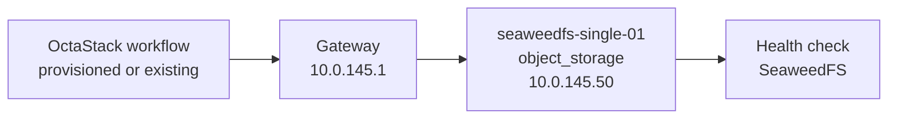
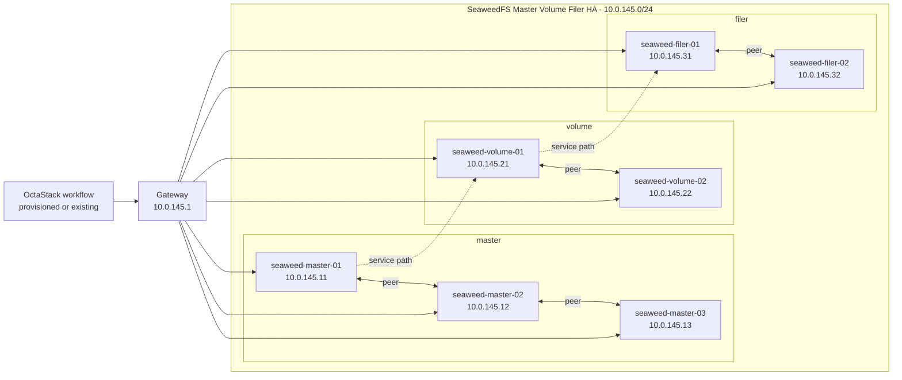

# SeaweedFS Topology

This document is generated from `tools/generate-library.mjs`. It describes the logical topology shared by the provisioned and existing-infrastructure workflow variants.

## Stack Summary

- Domain: `storage`
- Workflow path: `workflows/storage/seaweedfs`
- Stack network: `10.0.145.0/24`
- Gateway: `10.0.145.1`
- Single-node IP: `10.0.145.50`
- HA status: Generated

## Single-Node Topology

### Single-Node Inventory

| Node | Role | IP address | VM name | CPU | Memory MB | Disk GB |
| --- | --- | --- | --- | --- | --- | --- |
| seaweedfs-single-01 | object_storage | `10.0.145.50` | seaweedfs-single-01 | 4 | 8192 | 80 |

### Single-Node Workflows

| Pattern | Provisioning | Workflow |
| --- | --- | --- |
| single-node | provisioned | [single-node-provisioned.json](../../workflows/storage/seaweedfs/single-node-provisioned.json) |
| single-node | existing | [single-node-existing.json](../../workflows/storage/seaweedfs/single-node-existing.json) |

## High-Availability Topologies

### SeaweedFS Master Volume Filer HA

#### HA Inventory

| Node | Role | IP address | VM name | CPU | Memory MB | Disk GB |
| --- | --- | --- | --- | --- | --- | --- |
| seaweed-master-01 | master | `10.0.145.11` | seaweed-master-01 | 2 | 4096 | 40 |
| seaweed-master-02 | master | `10.0.145.12` | seaweed-master-02 | 2 | 4096 | 40 |
| seaweed-master-03 | master | `10.0.145.13` | seaweed-master-03 | 2 | 4096 | 40 |
| seaweed-volume-01 | volume | `10.0.145.21` | seaweed-volume-01 | 4 | 8192 | 300 |
| seaweed-volume-02 | volume | `10.0.145.22` | seaweed-volume-02 | 4 | 8192 | 300 |
| seaweed-filer-01 | filer | `10.0.145.31` | seaweed-filer-01 | 2 | 4096 | 80 |
| seaweed-filer-02 | filer | `10.0.145.32` | seaweed-filer-02 | 2 | 4096 | 80 |

#### HA Workflows

| Pattern | Provisioning | Workflow |
| --- | --- | --- |
| high-availability | provisioned | [master-volume-filer-ha-provisioned.json](../../workflows/storage/seaweedfs/master-volume-filer-ha-provisioned.json) |
| high-availability | existing | [master-volume-filer-ha-existing.json](../../workflows/storage/seaweedfs/master-volume-filer-ha-existing.json) |

## Addressing Rules

- The stack receives one `/24` from the parent `10.0.0.0/16` plan.
- `.1` is the example gateway.
- `.11-.49` are reserved for HA members and grouped by role in blocks of ten.
- `.50` is reserved for the single-node target.
